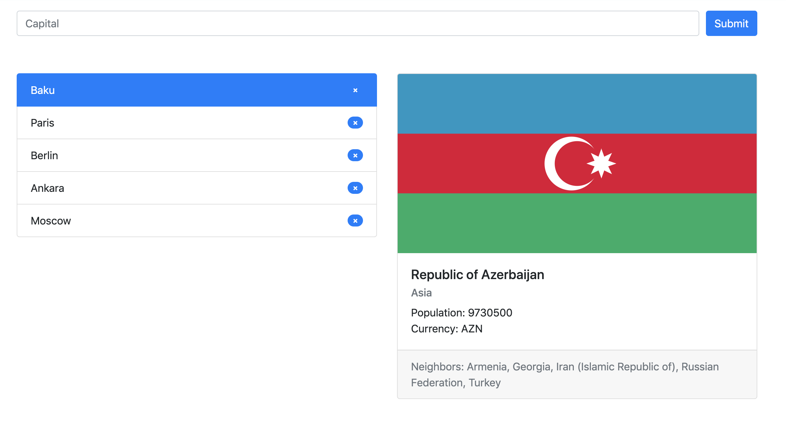

# React Task

## Objective
Build a React App that shows country information of given capitals. You can see a demo of working result below:

*Design and behavior*

* User inputs capital into the box
* When the user hits enter, city name appears in the list below and country info appears in the right side
* When user clicks city name, country info updates consequently
* User can remove any of the city from the list by clicking the "X" icon in front of the city name

## Resources

#### Data
Get the data from [Rest Countries](https://restcountries.eu) via API. You can find a API endpoints in `api.txt`

#### Instructions

* You may split up the main component in as many sub-components as you see fit
* The whole component must also be fully usable when just using a keyboard
* Think of it as a component that will end up in a large, scalable react app. Consider this when writing HTML and CSS as well.
* You're free to use as many third party JS libraries that you see fit
* You're free to use any build tools that you like (including CSS pre/post-processors). Do not focus on the tooling though. Choose tools that get you going quickly (when you're unsure, [create-react-app](https://github.com/facebookincubator/create-react-app/) might work well for you).

#### Bonus
* Using a `react-redux` would be a plus for your application

### How to submit your results:

* The results have to be shared as a git repository
* Create a public repository and send the link to __career[at]labrin.net__
* Or send the whole repository, zipped (including the `.git` directory) to given email address
* Important note: please only submit your work when it is completely done!

Happy coding! :heart:
